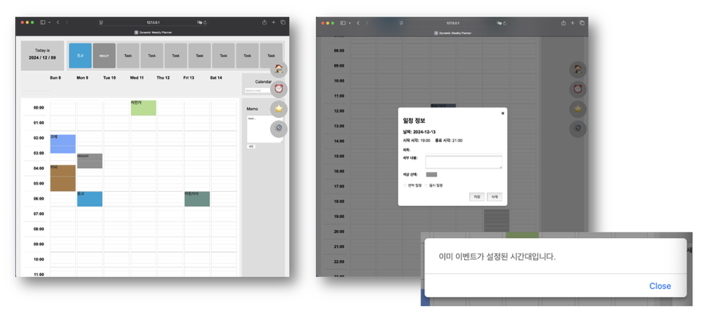
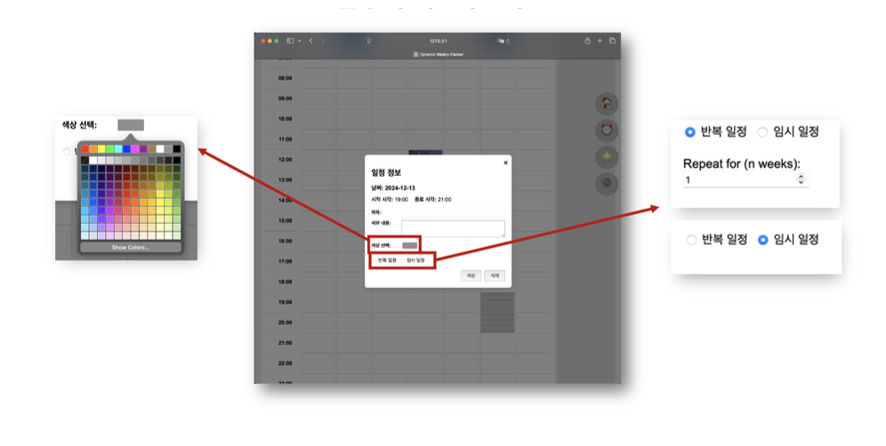
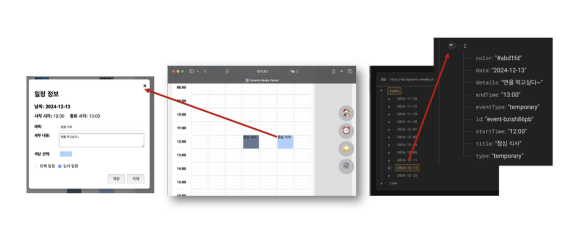
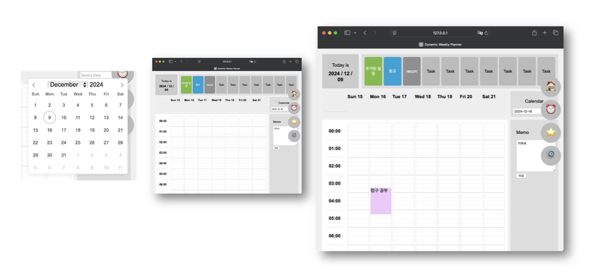
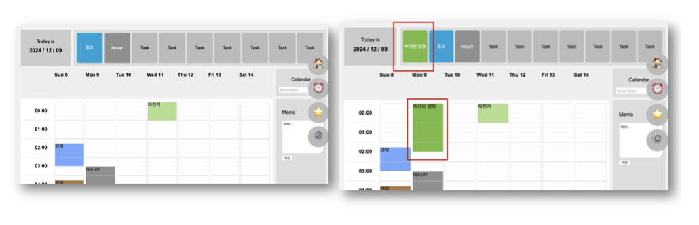
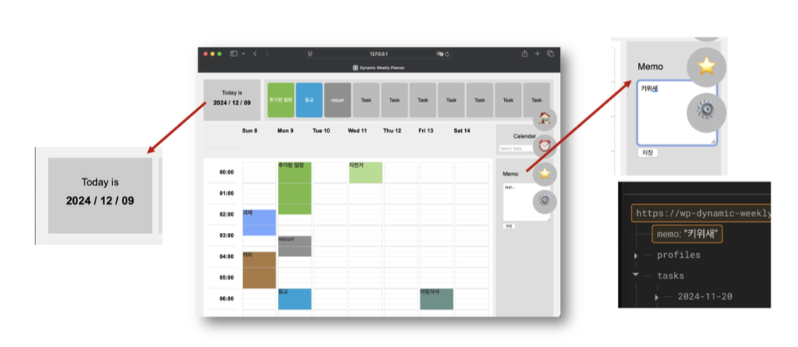
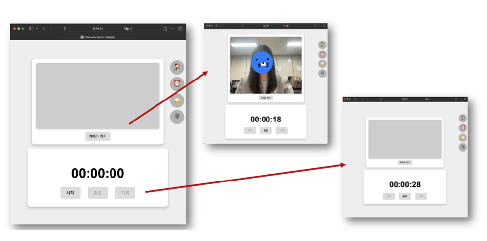
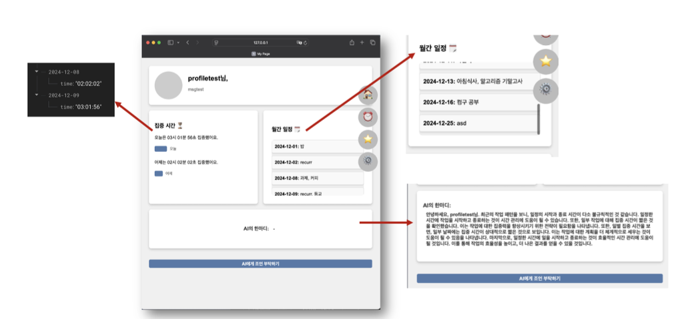
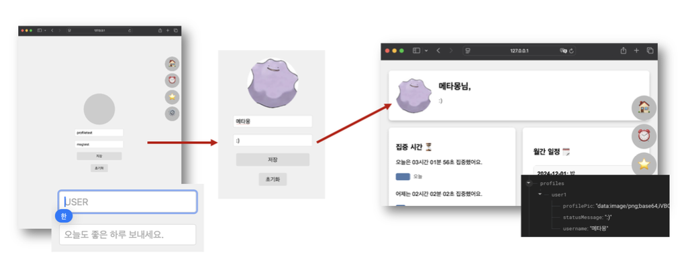

# Dynamic Weekly Planner

A web-based weekly planner with drag-to-schedule time blocks, a camera-triggered stopwatch, and a ChatGPT-powered advice panel.

<br>

## Tech Stack

| Category | Technology |
|----------|-----------|
| Frontend | HTML, CSS, Vanilla JavaScript |
| Database | Firebase Realtime Database |
| Libraries | TensorFlow.js (COCO-SSD), ChatGPT API (GPT-4), Flatpickr |

<br>

## Features

### Main — Weekly Timetable



- Drag across time slots to select a range; a modal opens to fill in event details.
- Alerts on conflict if the selected range overlaps an existing event.



- Color picker for block customization.
- Repeat option: enter a week count to register the same event across multiple weeks.



- Click an existing block to load and edit its data.

<br>

### Calendar Navigation



- Flatpickr date picker to navigate to any week's timetable.

<br>

### Task Overview & Memo



- Today's events shown as cards at the top, regardless of which week is currently displayed.



- Simple memo field, persisted in Firebase across refreshes.

<br>

### Stopwatch



- Uses TensorFlow.js with the COCO-SSD model to detect whether a person is in the webcam frame.
- Stopwatch starts when a person is detected, pauses when they leave.
- Can also be controlled manually with start/stop/record buttons.
- Record saves the elapsed time to Firebase as a cumulative daily total.

<br>

### My Page



- Progress bars comparing today's and yesterday's focus time.
- Scrollable list of all events in the current month.
- ChatGPT button sends schedule data to GPT-4 and displays scheduling advice.

<br>

### Settings



- Edit profile picture, name, and status message.
- Images are Base64-encoded and stored as text in Firebase (free tier has no file storage).
- Reset button clears all Firebase data.

<br>

## Project Structure

```
Dynamic-Weekly-Planner/
├── html/
│   ├── main.html
│   ├── stopwatch.html
│   ├── mypage.html
│   └── settings.html
├── css/
├── js/
│   └── firebase-config.js
└── images/
```

## Firebase Structure

```
root/
├── tasks/     # events per date
├── time/      # cumulative focus time per date
├── profiles/  # user profile + Base64 image
└── memo/      # memo text
```
